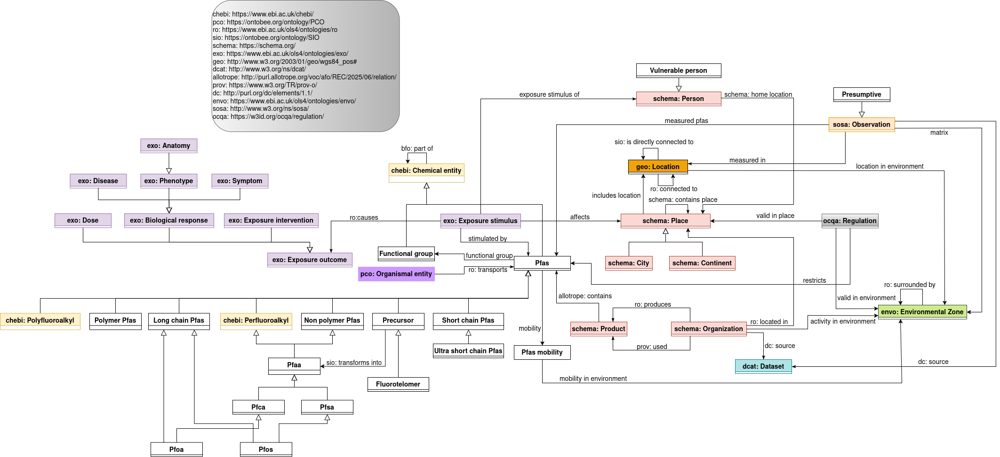

# OntoPFAS: an Ontology for the Forever Chemicals

| Prefix | IRI |
|----------|----------|
| ontopfas: | https://w3id.org/OntoPFAS  |

## Scope 

OntoPFAS is a conceptualization of the PFAS domain, concerning its exposure, measurement, and spread aspects. Combining chemical, geographical, and sensor data, it aims to represent a hub for practitioners of different fields willing to contribute with data, models, or artificial intelligence applications. With the parallel development of the [PFAS Data Hub dataset](https://pdh.cnrs.fr/en/datasets/), we set the ground to create a positive synergy between the availability of data and the solutions at disposal.

Many concepts are taken from existing domain ontologies like ChEBI, ExO, ENVO, and SOSA, while also exploiting the most common resources like Schema.org, PROV-O, and DCAT.

This ontology mainly represents these three different aspects of the PFAS concerns: chemistry, measurements, and exposure. The graphical architecture provides an overview of the provided elements.

  

## Evaluation

A static evaluation has been assessed by means of the following aspects:
- respecting the FAIR principles
- OntoMetrics to guarantee correct information distribution
- OOPS to avoid conceptual pitfalls
- answers to competency questions

## Content

The repository is comprehensive of the following resources:
- [functional requirements](ontology/competency_questions.csv) expressed by experts and translated into the form of competency questions,
- [schemas](ontology/schemas) of the ontology expressed with [Diagrams.net](https://www.drawio.com/),
- [source](ontology/pfas.rdf) of the ontology (available in RDF and TTL),
- [instances](instances/) taken from some dataset of the PDH,
- [evaluation](evaluation/) results,
- [documentation](index.html) of the resource.

## Publications
- Davide Di Pierro, Lylia Abrouk, Alexis Guyot, Danai Symeonidou, Pierre Labadie, Benjamin Lysaniuk: _OntoPFAS: Ontologie des PFAS et de leur exposition._ PFIA 2025: 80. (https://hal.science/hal-05189813v2/file/PFIA_Actes_IC2025.pdf#page=80) (preliminary result)

## Authored by:
Davide Di Pierro davide.di-pierro@umontpellier.fr  
Lylia Abrouk lylia.abrouk@u-bourgogne.fr  
Danai Symeonidou danai.symeonidou@inrae.fr  
Alexis Guyot alexis.guyot@lirmm.fr
